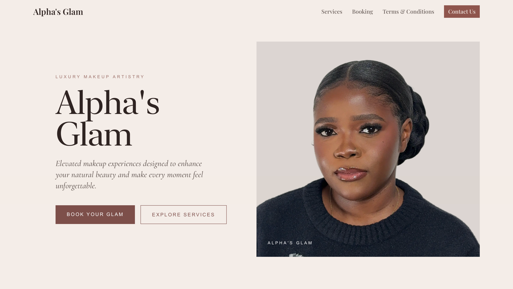
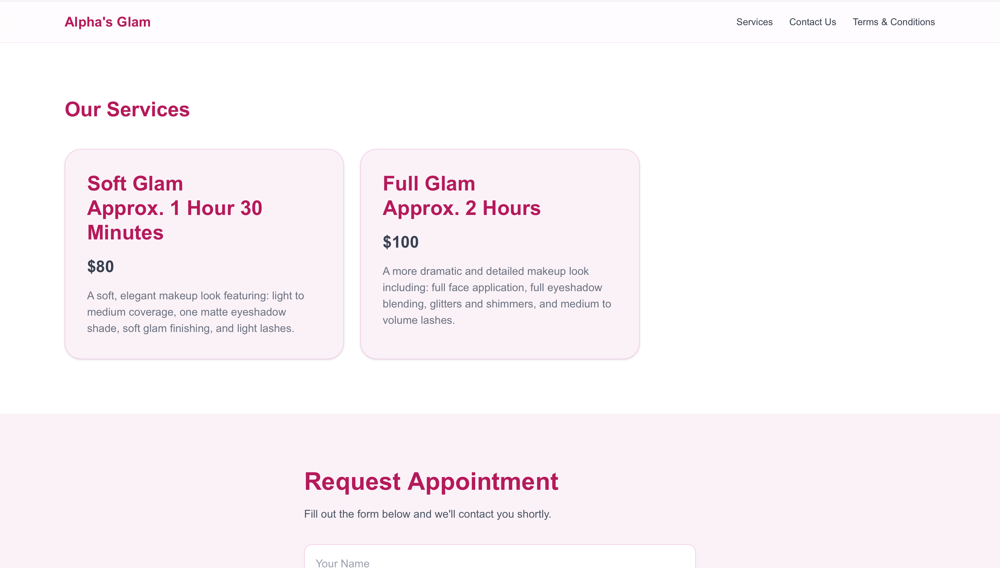
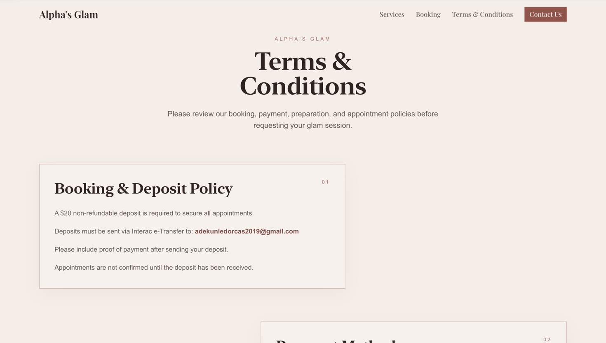

# Alpha's Glam 💄

Alpha's Glam is a modern full-stack makeup booking website built with Next.js for a freelance makeup artist. Customers can browse services, submit appointment requests, and receive automated confirmation emails, while the business owner receives booking notifications.

The project is deployed on Vercel and uses Resend for transactional emails.

**Live Demo:**
https://alphasglam.com
---

## Features

- ✨ Responsive landing page
- 💄 Services page with pricing
- 📅 Appointment booking form
- 📧 Automatic booking confirmation emails
- 📬 Admin notification emails
- 📋 Terms & Conditions page
- 🌐 Custom domain support
- ⚡ Fast deployment with Vercel

---

## Tech Stack

### Frontend

- Next.js (App Router)
- React
- TypeScript
- Tailwind CSS

### Backend

- Next.js API Routes
- Resend Email API

### Deployment

- Vercel
- Porkbun (Domain Registration)

---

## Email Functionality

The application sends two transactional emails whenever a booking is submitted:

### Customer

- Booking confirmation
- Appointment details
- Deposit instructions
- Preparation guidelines

### Business Owner

- New booking notification
- Customer information
- Requested service
- Date and time

Emails are powered by **Resend** using a verified custom domain.

---

## Deployment

Production deployment is handled by **Vercel**.

The custom domain is managed through **Porkbun** and connected to Vercel using DNS records.

---

## Screenshots

| Home | Services |
|------|----------|
|  |  |

| Booking | Terms & Conditions         |
|---------|----------------------------|
|  |  |---

## Author

**Obafunsho Thanni**

GitHub: https://github.com/funshothanni

---

## License

This project is for portfolio and educational purposes. All rights reserved.
